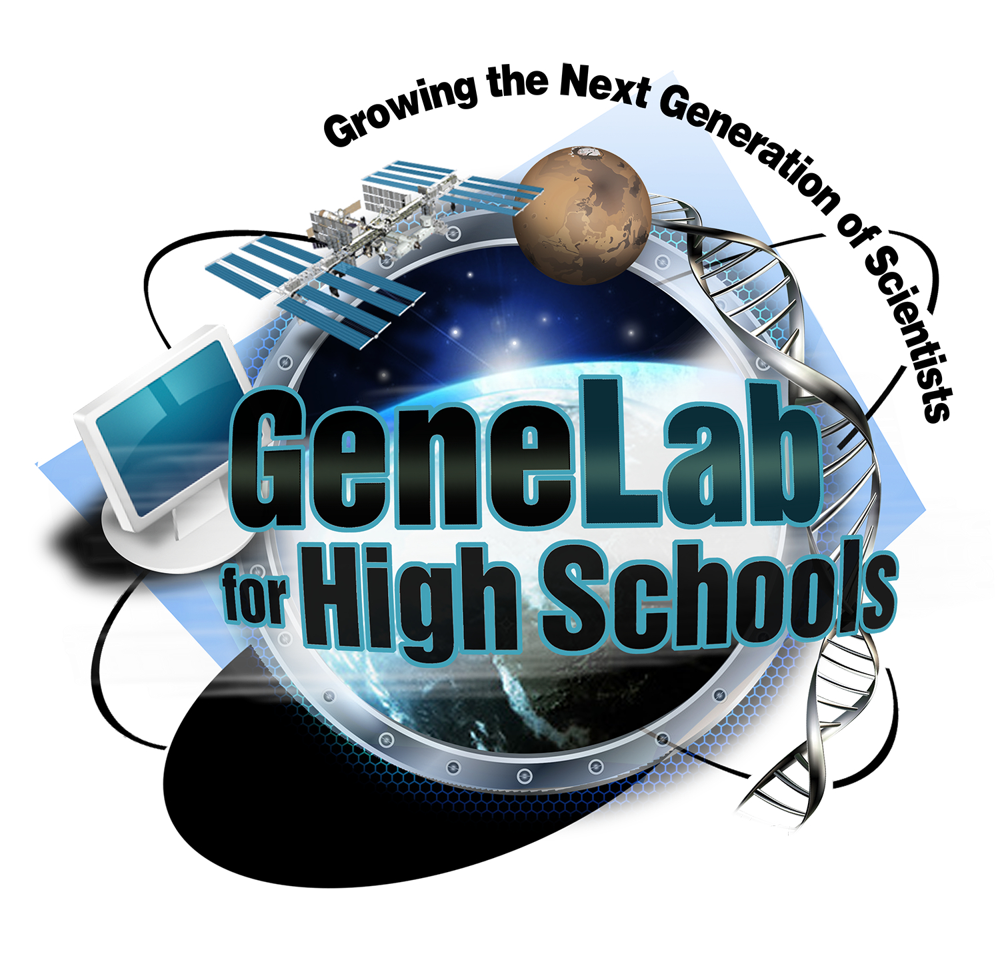

 

# GeneLab for High Schools: Growing the Next Generation of Scientists

 

## What is GL4HS?
GeneLab for High Schools (GL4HS) is a four-week intensive training program for rising high school juniors and seniors sponsored by NASA Ames Research Center (Mountain View, California). GL4HS provides students an opportunity to immerse themselves in space life sciences with a specific focus on omics-based bioinformatics research, the science of collecting and analyzing complex biological data such as genetic codes and computational biology.
> For more information, please visit [GeneLab's Educator Resources page](https://genelab.nasa.gov/overview-educator-resources).

 

**During the training program, students work closely with the GL4HS team to learn and/or obtain training in:**

- NASA space biology research
- Omics-based research
- Bioinformatics and computational biology methods and techniques to analyze omics data
- Applications of the bioinformatics analyses to NASA Space Biology science
- Development of a competitive team experimental proposal based on analysis of GeneLab data from the [Open Science Data Repository (OSDR)](https://osdr.nasa.gov/bio/repo/)
- Formal oral presentation skills
- Students will also network and form connections with guest lecturers including university professors and industry experts
- GL4HS provides an opportunity for students to develop their educational and scientific skills including leadership, team-work, data analysis, problem solving, and independent learning

 

---
## GL4HS Content

* [**General Resources**](General_Resources)

  - Instructional material for how to process a RNA sequencing (RNA-seq) dataset using the GL4HS-prepared training sets.

* [**Videos**](Videos)

  - Links to videos that supplement the GeneLab for High Schools Bioinformatics Manual by providing:
    - A walkthrough of the exercises.
    - Support for teachers who would like to use the analysis platform to introduce students to science research.
    - General information about the workflow. 
    - Tips for using the platform.
  

* [**Teacher-Created Materials**](Teacher_Created_Materials)

  - Training content created by former GL4HS teacher interns.
  

