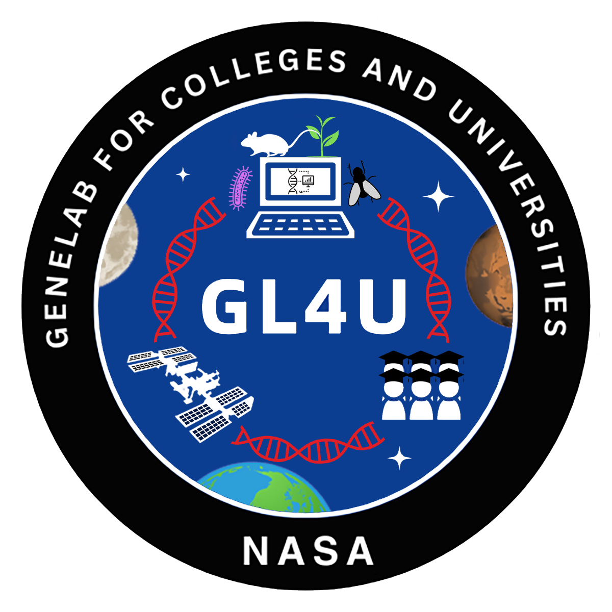

 

# GeneLab for Colleges and Universities (GL4U)

 

 

 

## About
GL4U is designed by [NASA GeneLab](https://www.nasa.gov/osdr-genelab-about/) in collaboration with the GeneLab Educational Working Group (EWG) to provide space biology-relevant training in bioinformatics to the next generation of scientists through direct and indirect approaches. The GeneLab team plans to host two annual data processing bootcamps, one for college-level students (direct) and one for college educators (indirect – training of trainers), for each type of omics data hosted on the [Open Science Data Repository](https://osdr.nasa.gov/bio/repo/). During the bootcamps, participants will learn about space biology, experimental design, data generation and associated technology usage, and perform hands-on analysis of space-relevant omics data using [GeneLab's standard processing pipelines](https://github.com/nasa/GeneLab_Data_Processing). This directory holds the college level training materials used to run the bootcamps for the omics assay types listed below including installation instructions for educators to set up and run these bootcamps at their home institutions.

---
## Assay Types
Click on an assay type below for training material:
- [RNA Sequencing](RNAseq)
- [Amplicon Sequencing](AmpSeq)  
