# Instructions For Setting Up the Bootcamp On the NASA NCCS SMCE System 

The Pilot GL4U: Educator RNAseq Bootcamp was designed to teach college-level educators how to process RNAseq data with [version D](https://github.com/nasa/GeneLab_Data_Processing/blob/master/RNAseq/Pipeline_GL-DPPD-7101_Versions/GL-DPPD-7101-D.md) of the [GeneLab RNA-seq consensus pipeline](https://www.ncbi.nlm.nih.gov/pmc/articles/PMC8044432/) using a series of Jupyter Notebooks (JNs). To allow all bootcamp participants to run the JNs within the same environment, the [NASA Center for Climate Simulation, NCCS](https://www.nccs.nasa.gov/) [Science Managed Could Environment, SMCE](https://www.nccs.nasa.gov/systems/SMCE) team set up a [JupyterHub](https://jupyter.org/hub) on their system. The GeneLab team equiped the JupyterHub environment with all the content needed for educators to teach the bootcamp content at their home institutions. For educators who successfully completed the Pilot GL4U: Educator RNAseq Bootcamp, follow the instructions below to request access for you to teach the bootcamp material to your students.     

---

## Table of contents  

- [Sign up for a time slot and request SMCE access](#request-access-to-the-nccs-smce-gl4u-jupyterhub)
- [Login to SMCE and set up bootcamp files](#getting-started)
- [Troubleshooting SMCE server issues](#troubleshooting-smce-server-issues)
- [Log out of SMCE](#log-out-of-smce)
- [Software used](#the-following-software-is-used-in-this-bootcamp)

---
## Request Access To the NCCS SMCE GL4U JupyterHub

**1. Sign up for an available 3-consecutive week time slot by clicking [here](https://calendar.google.com/calendar/u/0?cid=a2k0Z2lpbWFjMHA0NmpwbmdyanFxYmtxdjBAZ3JvdXAuY2FsZW5kYXIuZ29vZ2xlLmNvbQ).**
   > Note: Only one educator per 3-week time slot

**2. Once you have the google calendar open, click the create button on the top left then select "Event" as shown below:**

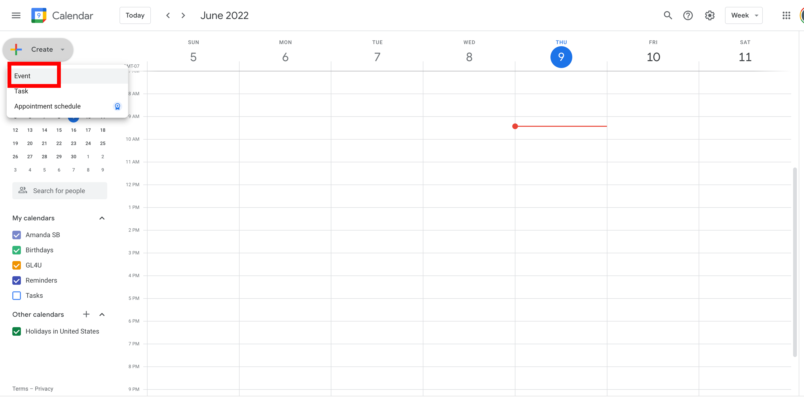

**3. For the Event name, write your frist initial followed by your last name then an underscore followed by GL4U as shown below:**

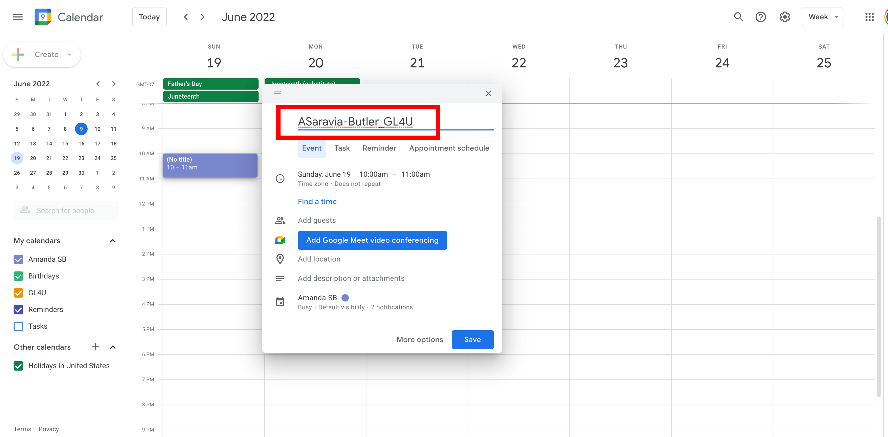

**4. Click on the box next to the clock icon to bring up the calendar and select your desired start date as shown below:**

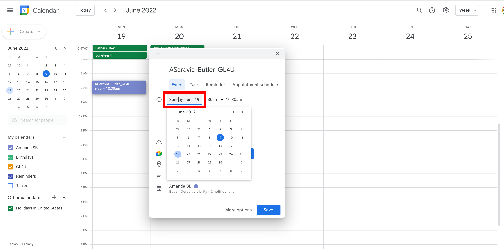

**5. Click on the "All day" box, which will change the end time to a date as shown below:**

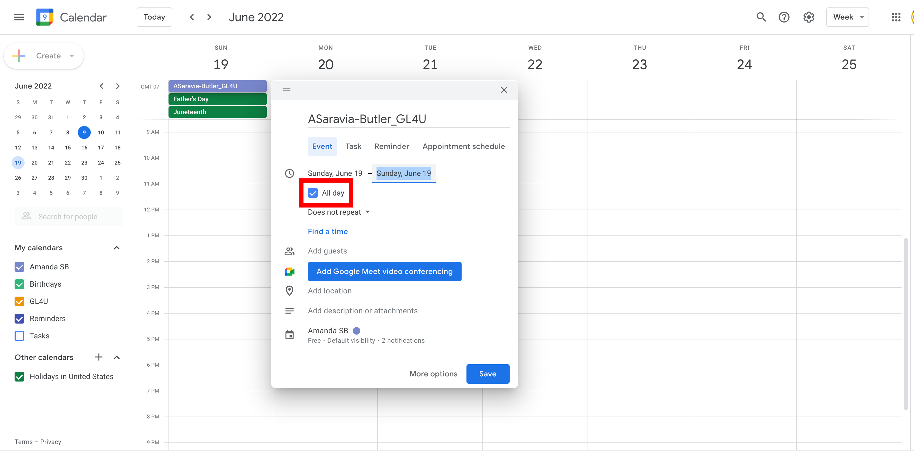

**6. Click on the box to the right of your start date to bring up the calendar and select your desired end date as shown below:**

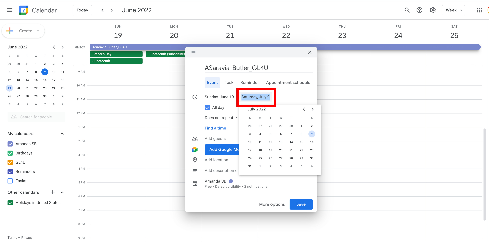

**7. Click on the box to the right of the calendar icon and select "GL4U" as shown below:**

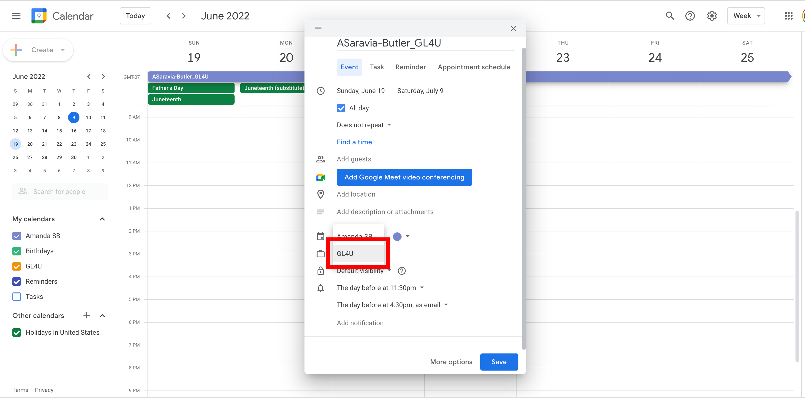

**8. Click the "Save" button on the bottom right to confirm your SMCE time slot as shown below:**

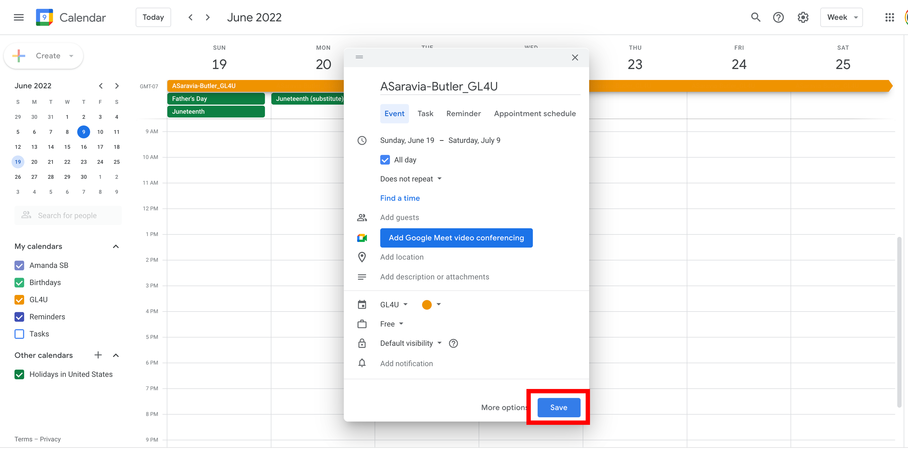

**9. If you have to modify your reserved time slot, go to the [GL4U google calendar](https://calendar.google.com/calendar/u/0?cid=a2k0Z2lpbWFjMHA0NmpwbmdyanFxYmtxdjBAZ3JvdXAuY2FsZW5kYXIuZ29vZ2xlLmNvbQ), click on your reserved time slot and select the pencil icon to edit as shown below:**

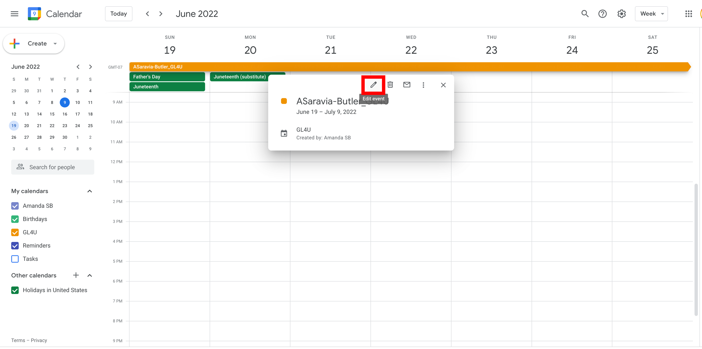

**10. Send a list of up to 30 students, with the following info for each student, to Amanda (amanda.m.saravia-butler@nasa.gov) at least 2 weeks before the start of your 3-week time slot.** 

   Information needed from each student to set up accounts:
   > Full name  
   > Proposed username (lastname_firstinitial)   
   > E-mail address  
   > A US phone number capable of receiving SMS text messages   

**11. Amanda will notify you when all user accounts have been set up within 1-week of your 3-week time slot.**

---
## Getting Started

Once accounts have been set up for the educator(s) and all students, follow the instructions below to get started:

**1. Go to [https://daskhub.gl4u.mysmce.com/](https://daskhub.gl4u.mysmce.com/) and type in your username and password. You will receive a text message with a code to fill in on the next screen.**
   > Note: If it is your first time logging in, you will be prompted to change your password.

 

**2. You will then be prompted to select a server. Select the "Small Server (On-Demand)" from the option list and click "Start" as shown below:**

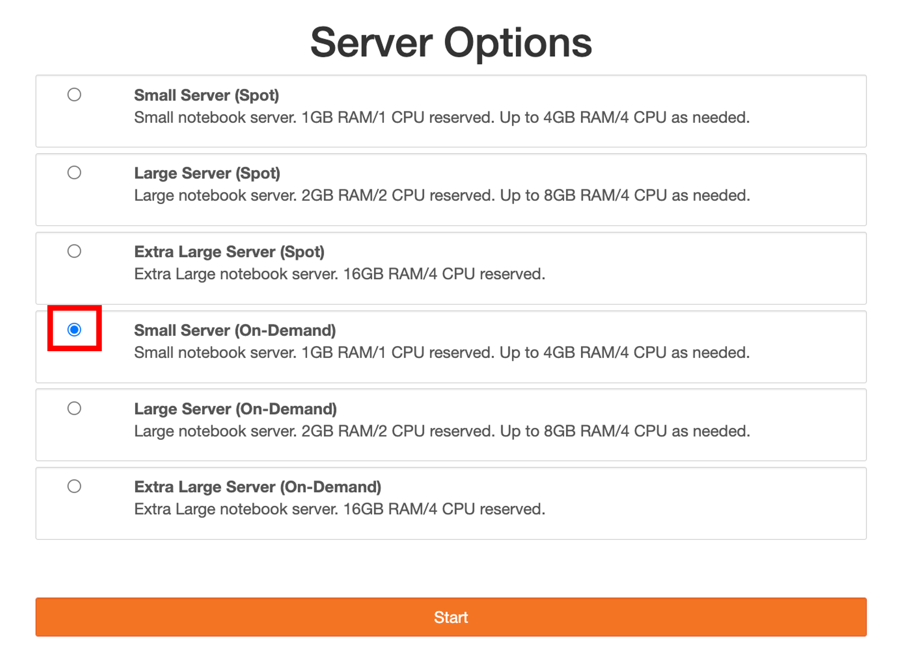

**3. Once your server is up, under the "Other" section, click on the "Terminal" icon as indicated in the image below.**

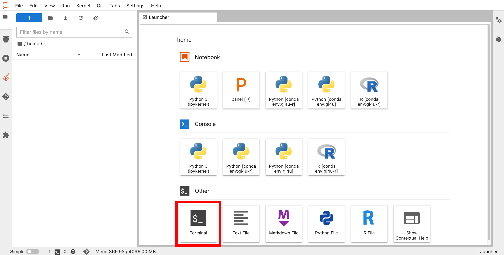
  
 
  
**4. In the terminal window, run the following command to copy all the files needed to run the bootcamp to your `/home` directory:**

`/efs/GL4U/RNAseq_Bootcamps/202206_RNAseq_Educator/copy_JN_files.sh`

   > If you modified the JNs and want to use your modified JNs when teaching at your home institution, run the following command instead:   
   > `/efs/GL4U/RNAseq_Bootcamps/202206_RNAseq_Educator/copy_flastname_JN_files.sh`   
   > Where f is the first initial of your last name (lowercase) and lastname is your last name (lowercase).   
  
 
  
**5. You should now see the following files added to your `/home` directory, listed on the left side of your screen:**  
   RNAseq_DGE_JN_06-2022.ipynb  
   RNAseq_fastq_to_counts_JN_06-2022.ipynb   
   R_Intro_JN_06-2022.ipynb  
   Saturn.txt  
   Unix_Intro_JN_06-2022.ipynb  
   example.csv  
   example.txt  
  
 
  
**6. Double click on the "Unix_Intro_JN_06-2022.ipynb" in the left panel to open the first JN in the hands-on portion of the bootcamp as shown in the image below:**

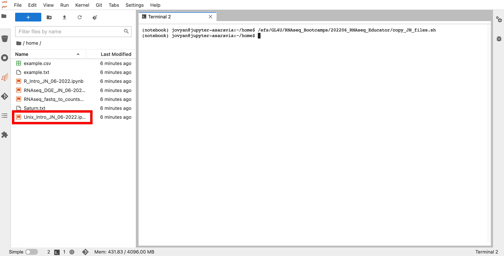 
  
 

**7. You are now ready to run the hands-on portion of the bootcamp. A few things to note about the specific JNs to make sure everything runs smoothly:**  
  * When running the "Unix_Intro_JN_06-2022.ipynb" and "RNAseq_fastq_to_counts_JN_06-2022.ipynb" JNs, make sure the kernel running, as indicated in the top right corner of the JN window, is "Python [conda env:gl4u]". If it is not, click on the kernel shown, and select "Python [conda env:gl4u]" from the drop-down menu as indicated in the image below.

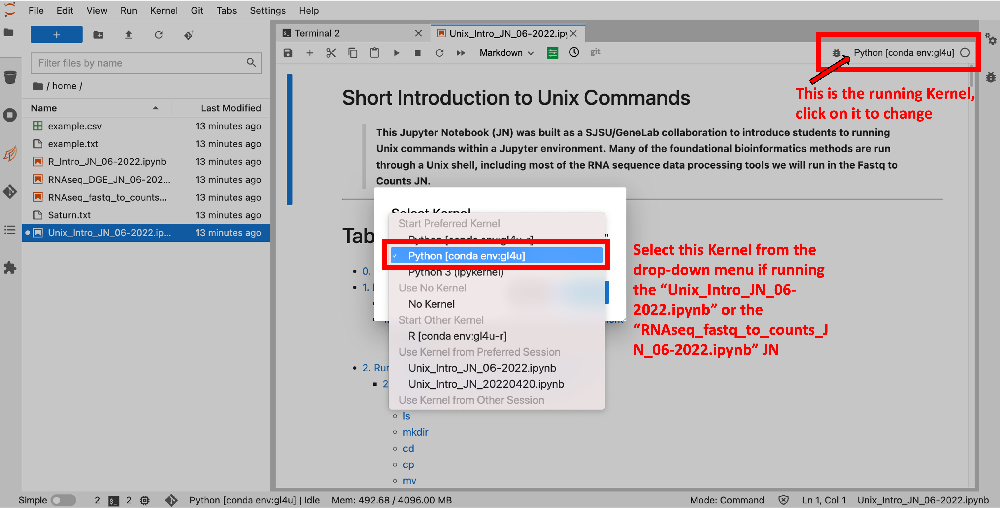
  
 
  
   * When running the "R_Intro_JN_06-2022.ipynb" and "RNAseq_DGE_JN_06-2022.ipynb" JNs, make sure the kernel running, as indicated in the top right corner of the JN window, is "R [conda env:gl4u-r]". If it is not, click on the kernel shown, and select "R [conda env:gl4u-r]" from the drop-down menu as indicated in the image below.

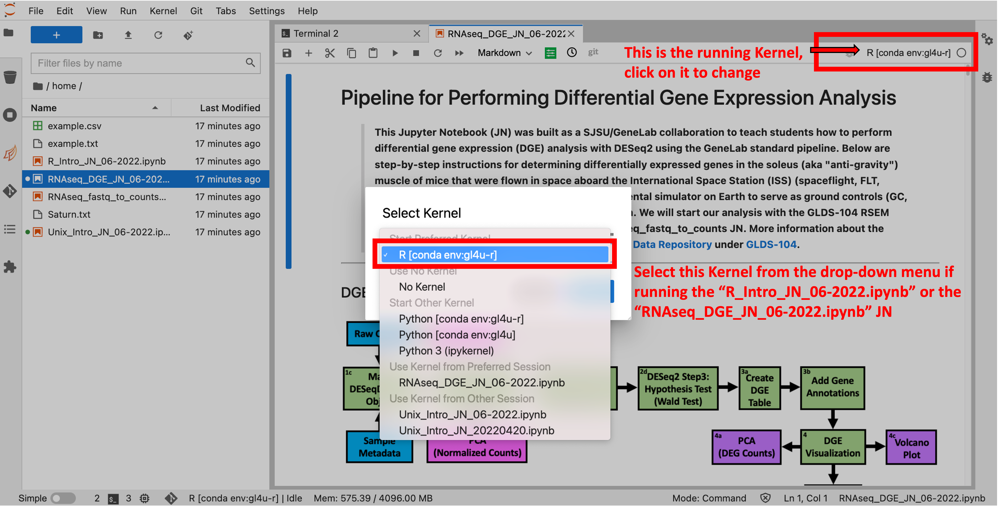
  
 
  
---

## Troubleshooting SMCE Server Issues

If you are have having issues with your SMCE server instance and re-setting the kernel (as described in [step 7](#RestartKernel) above) does not resolve the issue, you may have to stop your current server instance and start a new one as described below:

**1. To stop your server go to `File` (in the top left corner) then click on `Hub Control Panel` as shown in the image below:**
   > Note: This will open up a new window.**

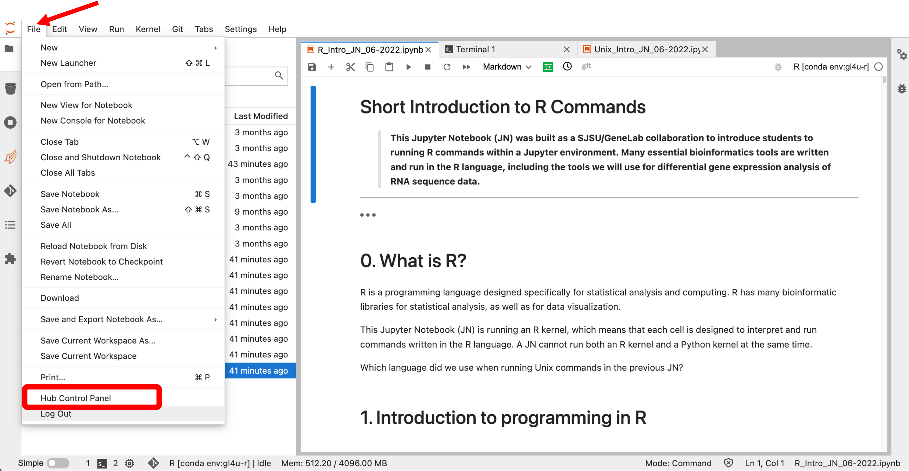

 

**2. In the new window that has opened, click on the red button that says `Stop My Server` as shown in the image below:** 
   > Note: You may have to click it twice to stop the server instance

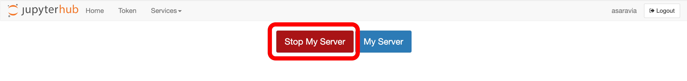

 

**3. To start a new SMCE server instance, click the new blue button that appears and says `Start My Server` as shown in the image below:**

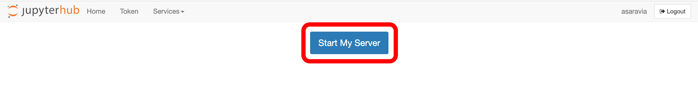

 

---

## Log Out of SMCE

When you are done working on the SMCE system, it is very important to log out of SMCE by following the instructions below:
> Note: Don't forget to save your work before logging out. Logging out of SMCE will automatically stop your server instance.

**To log out of SMCE, go to `File` (in the top left corner) then click on `Log Out` as shown in the image below:** 

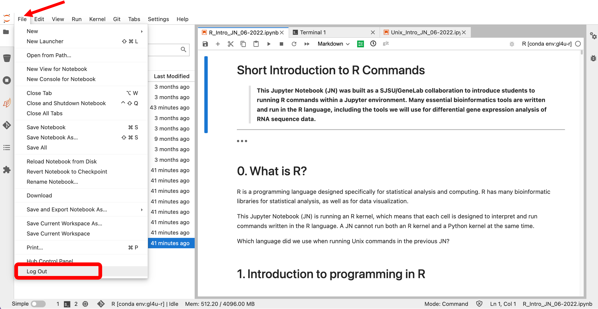

 

---

## The Following Software Is Used In This Bootcamp:

|Program|Version|Relevant Links|
|:------|:------:|:-------------|
|FastQC|0.11.9|[https://www.bioinformatics.babraham.ac.uk/projects/fastqc/](https://www.bioinformatics.babraham.ac.uk/projects/fastqc/)|
|MultiQC|1.12|[https://multiqc.info/](https://multiqc.info/)|
|Cutadapt|3.7|[https://cutadapt.readthedocs.io/en/stable/](https://cutadapt.readthedocs.io/en/stable/)|
|TrimGalore!|0.6.7|[https://www.bioinformatics.babraham.ac.uk/projects/trim_galore/](https://www.bioinformatics.babraham.ac.uk/projects/trim_galore/)|
|STAR|2.7.10a|[https://github.com/alexdobin/STAR](https://github.com/alexdobin/STAR)|
|RSEM|1.3.1|[https://github.com/deweylab/RSEM](https://github.com/deweylab/RSEM)|
|Samtools|1.15|[http://www.htslib.org/](http://www.htslib.org/)|
|gtfToGenePred|377|[http://hgdownload.cse.ucsc.edu/admin/exe/](http://hgdownload.cse.ucsc.edu/admin/exe/)|
|genePredToBed|377|[http://hgdownload.cse.ucsc.edu/admin/exe/](http://hgdownload.cse.ucsc.edu/admin/exe/)|
|infer_experiment|4.0.0|[http://rseqc.sourceforge.net/#infer-experiment-py](http://rseqc.sourceforge.net/#infer-experiment-py)|
|geneBody_coverage|4.0.0|[http://rseqc.sourceforge.net/#genebody-coverage-py](http://rseqc.sourceforge.net/#genebody-coverage-py)|
|inner_distance|4.0.0|[http://rseqc.sourceforge.net/#inner-distance-py](http://rseqc.sourceforge.net/#inner-distance-py)|
|read_distribution|4.0.0|[http://rseqc.sourceforge.net/#read-distribution-py](http://rseqc.sourceforge.net/#read-distribution-py)|
|R|4.1.2|[https://www.r-project.org/](https://www.r-project.org/)|
|Bioconductor|3.14.0|[https://bioconductor.org](https://bioconductor.org)|
|DESeq2|1.34|[https://bioconductor.org/packages/release/bioc/html/DESeq2.html](https://bioconductor.org/packages/release/bioc/html/DESeq2.html)|
|tximport|1.22|[https://bioconductor.org/packages/release/bioc/html/tximport.html](https://bioconductor.org/packages/release/bioc/html/tximport.html)|
|tidyverse|1.3.1|[https://www.tidyverse.org](https://www.tidyverse.org)|
|Risa|1.36|[https://www.bioconductor.org/packages/release/bioc/html/Risa.html](https://www.bioconductor.org/packages/release/bioc/html/Risa.html)|
|STRINGdb|2.6.0|[https://www.bioconductor.org/packages/release/bioc/html/STRINGdb.html](https://www.bioconductor.org/packages/release/bioc/html/STRINGdb.html)|
|PANTHER.db|1.0.11|[https://bioconductor.org/packages/release/data/annotation/html/PANTHER.db.html](https://bioconductor.org/packages/release/data/annotation/html/PANTHER.db.html)|
|org.Mm.eg.db|3.14.0|[https://bioconductor.org/packages/release/data/annotation/html/org.Mm.eg.db.html](https://bioconductor.org/packages/release/data/annotation/html/org.Mm.eg.db.html)|

