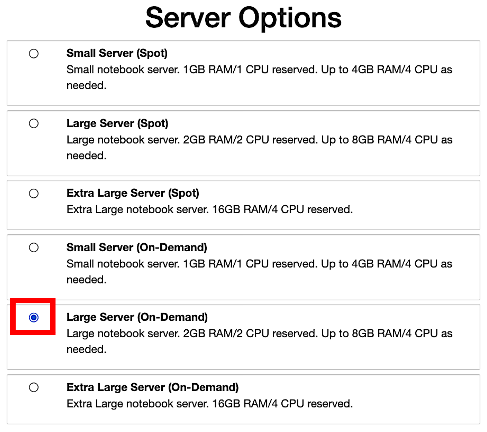
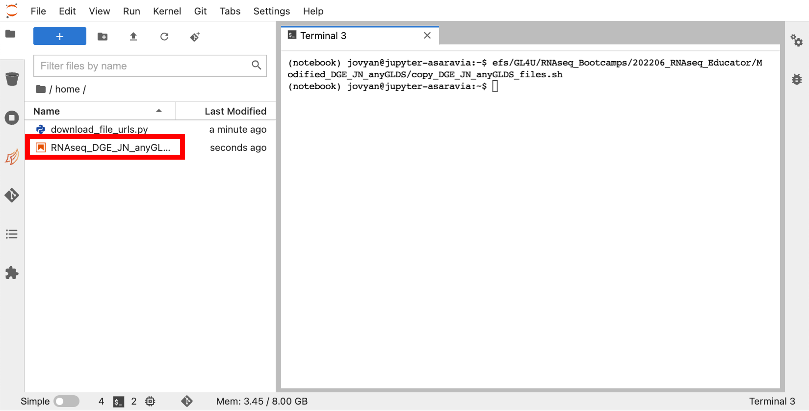
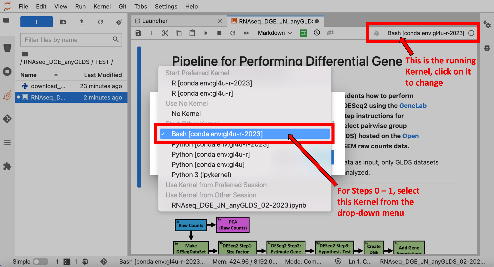
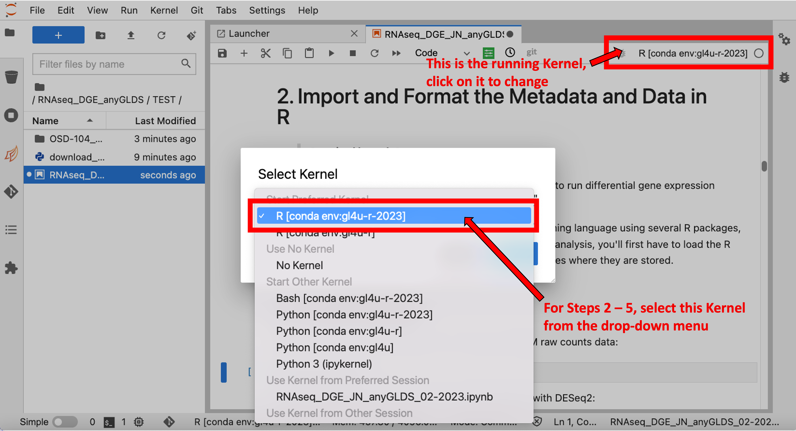
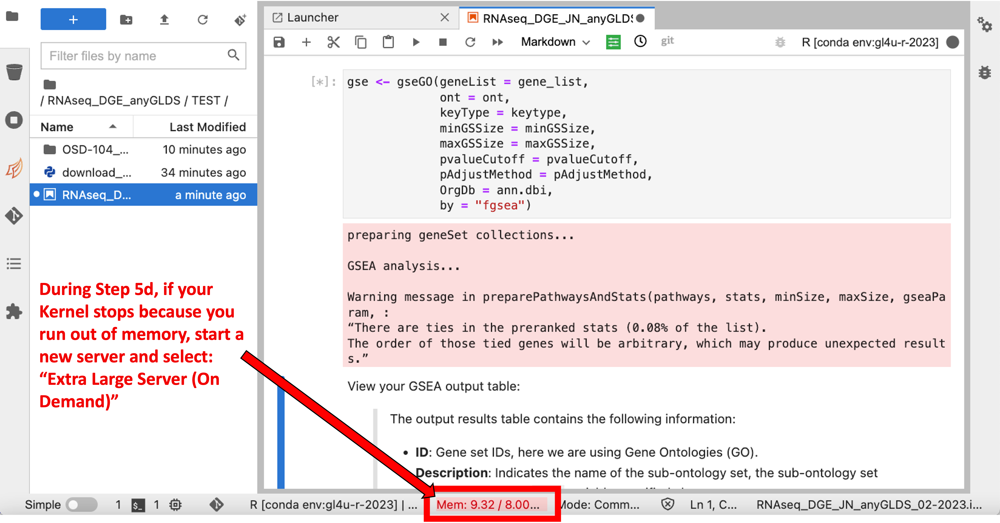
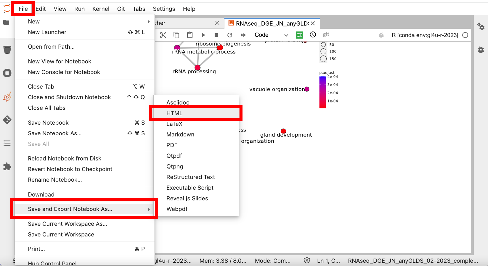

# Perform Differential Gene Expression (DGE) Analysis on RNA Sequence (RNAseq) Data Using a Jupyter Notebook (JN)

The JN in this directory contains instructions and commands for performing DGE analysis on any RNAseq [GeneLab Dataset (GLDS)](https://osdr.nasa.gov/bio/repo/) starting with RSEM raw gene counts, and subsequently generating data visualizations. The tools and commands used are consistent with [GeneLab's RNAseq standard processing pipeline, version F](https://github.com/nasa/GeneLab_Data_Processing/blob/master/RNAseq/Pipeline_GL-DPPD-7101_Versions/GL-DPPD-7101-F.md). The modified GL4U RNAseq DGE JN is set up to run on the [NASA Center for Climate Simulation (NCCS)](https://www.nccs.nasa.gov/) [Science Managed Could Environment (SMCE)](https://www.nccs.nasa.gov/systems/SMCE) system. An example of the completed modified RNAseq DGE JN in HTML format can be found in the [Example_RNAseq_DGE_JN_anyGLDS](Example_RNAseq_DGE_JN_anyGLDS) subdirectory.
> Note: Due to the large file size of the JN, it may take a while to load when viewing through the web portal. To avoid issues loading the JN file, you can download the file to your local system by cloning [this repository](https://github.com/asaravia-butler/GeneLab_Training) using [these GitHub instructions](https://docs.github.com/en/github/creating-cloning-and-archiving-repositories/cloning-a-repository-from-github/cloning-a-repository#cloning-a-repository).

 

---

## Table of contents  

- [Files for running the modified DGE JN](#jupyter-notebook-files)
- [Login to SMCE and set up the modified DGE JN files](#getting-started)
- [Troubleshooting SMCE server issues](#troubleshooting-smce-server-issues)
- [Export the completed DGE JN](#export-the-completed-jn-as-html)
- [Log out of SMCE](#log-out-of-smce)
- [Software used](#the-following-software-is-used-in-this-jn)

 

---
## Jupyter Notebook Files
- [RNAseq DGE JN for Any GLDS](RNAseq_DGE_JN_anyGLDS_02-2023.ipynb): 
  - Modified version of the RNAseq DGE JN used during the Educator Pilot bootcamp that allows a user to perform DGE analysis on any RNAseq [GeneLab Dataset (GLDS)](https://osdr.nasa.gov/bio/repo/) starting with RSEM raw gene counts.
- [Script to Download GLDS Files](download_file_urls.py):
  - This script is called in the modified DGE JN to download the required metadata and RSEM raw gene counts files for the select RNAseq GLDS from the [Open Science Data Repository (OSDR)](https://osdr.nasa.gov/bio/repo/).

 

---
## Getting Started

Once your SMCE account is set up, follow the instructions below to get started:

**1. Go to [https://daskhub.gl4u.mysmce.com/](https://daskhub.gl4u.mysmce.com/) and type in your username and password. You will receive a text message with a code to fill in on the next screen.**
   > Note: If it is your first time logging in, you will be prompted to change your password.

 

**2. You will then be prompted to select a server. Select the "Large Server (On-Demand)" from the option list and click "Start" as shown below:**

**3. Once your server is up, under the "Other" section, click on the "Terminal" icon as indicated in the image below.**

  
 
  
**4. In the terminal window, run the following command to copy all the files needed to run the modified DGE JN to your `/home` directory:**

`/efs/GL4U/RNAseq_Bootcamps/202206_RNAseq_Educator/Modified_DGE_JN_anyGLDS/copy_DGE_JN_anyGLDS_files.sh` 
  
 
  
**5. You should now see the following files added to your `/home` directory, listed on the left side of your screen:**  
   RNAseq_DGE_JN_anyGLDS_02-2023.ipynb  
   download_file_urls.py   
  
 
  
**6. Double click on the "RNAseq_DGE_JN_anyGLDS_02-2023.ipynb" file in the left panel to open the modified DGE JN as shown in the image below:**

 
  
 

**7. You are now ready to run the modified RNAseq DGE JN. A few things to note about the modified DGE JN to make sure everything runs smoothly:**  
  * When running steps 0 - 1 of the "RNAseq_DGE_JN_anyGLDS_02-2023.ipynb" JN, make sure the kernel running, as indicated in the top right corner of the JN window, is "Bash [conda env:gl4u-r-2023]". If it is not, click on the kernel shown, and select "Bash [conda env:gl4u-r-2023]" from the drop-down menu as indicated in the image below.

  
 
  
   * When running steps 2 - 5 of the "RNAseq_DGE_JN_anyGLDS_02-2023.ipynb" JN, make sure the kernel running, as indicated in the top right corner of the JN window, is "R [conda env:gl4u-r-2023]". If it is not, click on the kernel shown, and select "R [conda env:gl4u-r-2023]" from the drop-down menu as indicated in the image below.

  
 
  
---

## Troubleshooting SMCE Server Issues

If you are have having issues with your SMCE server instance and re-setting the kernel (as described in [step 7](#RestartKernel) above) does not resolve the issue, you may have to stop your current server instance and start a new one as described below:

**1. To stop your server go to `File` (in the top left corner) then click on `Hub Control Panel` as shown in the image below:**
   > Note: This will open up a new window.**

 

**2. In the new window that has opened, click on the red button that says `Stop My Server` as shown in the image below:** 
   > Note: You may have to click it twice to stop the server instance

 

**3. To start a new SMCE server instance, click the new blue button that appears and says `Start My Server` as shown in the image below:**

 

**Depending on the size of your select RNAseq GLDS, when you run the `gseGO()` command in step 5d of the "RNAseq_DGE_JN_anyGLDS_02-2023.ipynb" JN, you may run out of memmory as indicated in the image below, which could cause your server to crash.**
   > If this happens, follow the instructions above to start a new server, but this time select the "Extra Large Server (On-Demand)" from the option list.

 

---

## Export The Completed JN as HTML

When you have finished running the modified DGE JN on the SMCE system, you can save your completed DGE JN as an HTML file by following the instructions below:

**Go to `File` (in the top left corner), click on `Save and Export Notebook As...` then select `HTML` as shown in the image below:** 

 

---

## Log Out of SMCE

When you are done working on the SMCE system, it is very important to log out of SMCE by following the instructions below:
> Note: Don't forget to save your work before logging out. Logging out of SMCE will automatically stop your server instance.

**To log out of SMCE, go to `File` (in the top left corner) then click on `Log Out` as shown in the image below:** 

 

---

## The Following Software Is Used In This JN:

|Program|Version|Relevant Links|
|:------|:------:|:-------------|
|jupyterlab|3.6.1|[https://jupyter.org/](https://jupyter.org/)|
|dp_tools|1.2.1|[https://github.com/J-81/dp_tools](https://github.com/J-81/dp_tools)|
|R|4.2.1|[https://www.r-project.org/](https://www.r-project.org/)|
|Bioconductor|3.16.0|[https://bioconductor.org](https://bioconductor.org)|
|DESeq2|1.38.0|[https://bioconductor.org/packages/release/bioc/html/DESeq2.html](https://bioconductor.org/packages/release/bioc/html/DESeq2.html)|
|tximport|1.27.1|[https://github.com/mikelove/tximport](https://github.com/mikelove/tximport)|
|tidyverse|1.3.2|[https://www.tidyverse.org](https://www.tidyverse.org)|
|stringr|1.5.0|[https://github.com/tidyverse/stringr](https://github.com/tidyverse/stringr)|
|STRINGdb|2.8.4|[https://www.bioconductor.org/packages/release/bioc/html/STRINGdb.html](https://www.bioconductor.org/packages/release/bioc/html/STRINGdb.html)|
|PANTHER.db|1.0.11|[https://bioconductor.org/packages/release/data/annotation/html/PANTHER.db.html](https://bioconductor.org/packages/release/data/annotation/html/PANTHER.db.html)|
|rtracklayer|1.58.0|[https://bioconductor.org/packages/release/bioc/html/rtracklayer.html](https://bioconductor.org/packages/release/bioc/html/rtracklayer.html)
|org.Hs.eg.db|3.16.0|[https://bioconductor.org/packages/release/data/annotation/html/org.Hs.eg.db.html](https://bioconductor.org/packages/release/data/annotation/html/org.Hs.eg.db.html)|
|org.Mm.eg.db|3.16.0|[https://bioconductor.org/packages/release/data/annotation/html/org.Mm.eg.db.html](https://bioconductor.org/packages/release/data/annotation/html/org.Mm.eg.db.html)|
|org.Rn.eg.db|3.16.0|[https://bioconductor.org/packages/release/data/annotation/html/org.Rn.eg.db.html](https://bioconductor.org/packages/release/data/annotation/html/org.Rn.eg.db.html)
|org.Dm.eg.db|3.16.0|[https://bioconductor.org/packages/release/data/annotation/html/org.Dm.eg.db.html](https://bioconductor.org/packages/release/data/annotation/html/org.Dm.eg.db.html)|
|org.Ce.eg.db|3.16.0|[https://bioconductor.org/packages/release/data/annotation/html/org.Ce.eg.db.html](https://bioconductor.org/packages/release/data/annotation/html/org.Ce.eg.db.html)|
|org.At.tair.db|3.16.0|[https://bioconductor.org/packages/release/data/annotation/html/org.At.tair.db.html](https://bioconductor.org/packages/release/data/annotation/html/org.At.tair.db.html)|
|org.EcK12.eg.db|3.16.0|[https://bioconductor.org/packages/release/data/annotation/html/org.EcK12.eg.db.html](https://bioconductor.org/packages/release/data/annotation/html/org.EcK12.eg.db.html)|
|org.Sc.sgd.db|3.16.0|[https://bioconductor.org/packages/release/data/annotation/html/org.Sc.sgd.db.html](https://bioconductor.org/packages/release/data/annotation/html/org.Sc.sgd.db.html)|
