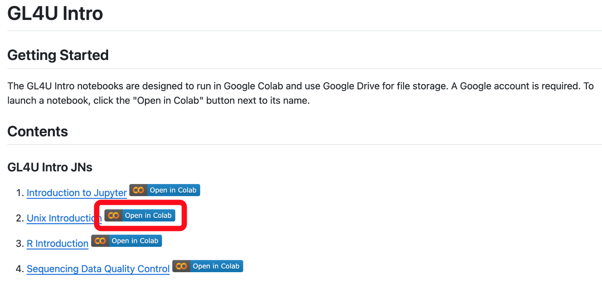
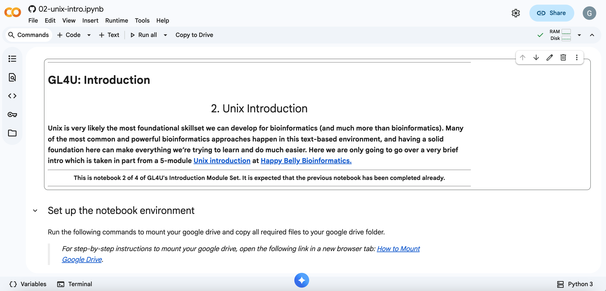
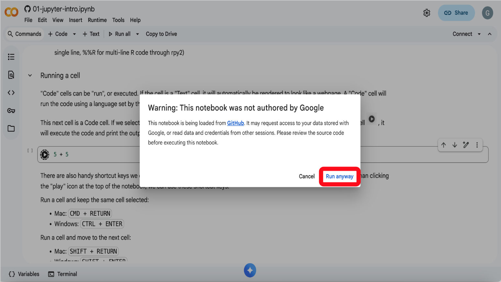
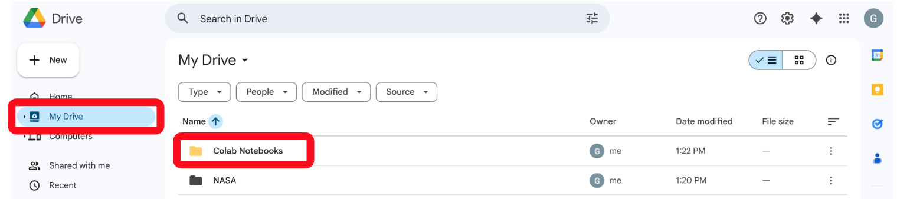
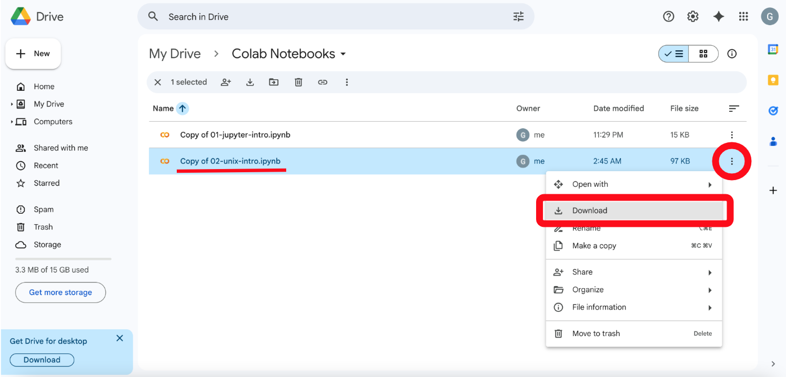

# Unix Introduction

Next, we'll go through an introduction to coding in Unix hands-on activity using a Jupyter Notebook within a Google Colab environment.  
> _Notes:_
> - _If you have not completed the previous [Jupyter Introduction](Access_Jupyter_JN.md) hands-on activity, please go back and complete that activity before this one._
> - _We'll be using Google Colab, so if you haven't done so already, follow [these instructions](Colab_Instructions.md) to set up your Google account and verify access to Google Colab._

 

## Access the Unix Introduction Jupyter Notebook

1. If you are not already logged in to your Google account, got to [https://accounts.google.com/](https://accounts.google.com/) and log in.

2. Navigate to the [GL4U_Intro_2024_Colab README](../README.md) page and click on the "Open in Colab" icon next to "2. Unix Introduction", as shown below:
   > _Note: It is recommended to open the Colab notebook in a new tab so these instructions remain available._

  

  

3. You should now see the 02-unix-intro.ipynb jupyter notebook (JN) opened in Google Colab, as shown below:

  

 

4. Follow the instructions in the 02-unix-intro.ipynb JN to complete all activities. Read through the JN carefully so you do not miss any activities.
   > Note: When you run your first code cell in the Colab notebook, you may see the following pop-up. If you do, click "Run anyway" to continue, as shown below:

  

 

## Upload Your Completed JN To Canvas

1. After you have completed all activities in the 02-unix-intro.ipynb JN and saved your completed JN to your Google Drive, open [Google Drive](https://drive.google.com/drive/my-drive) in a new tab, and click "My Drive" in the left side panel, then double click on the "Colab Notebooks" folder as shown below.

  

 

2. In the "Colab Notebooks" folder, click on the 3 dots to the right of the "Copy of 02-unix-intro.ipynb" file, then click "Download", as shown below, to save a copy to your computer.

  

 

3. Return to Canvas and upload your completed JN to "HANDS-ON_ACTIVITY_3" to receive credit.  
