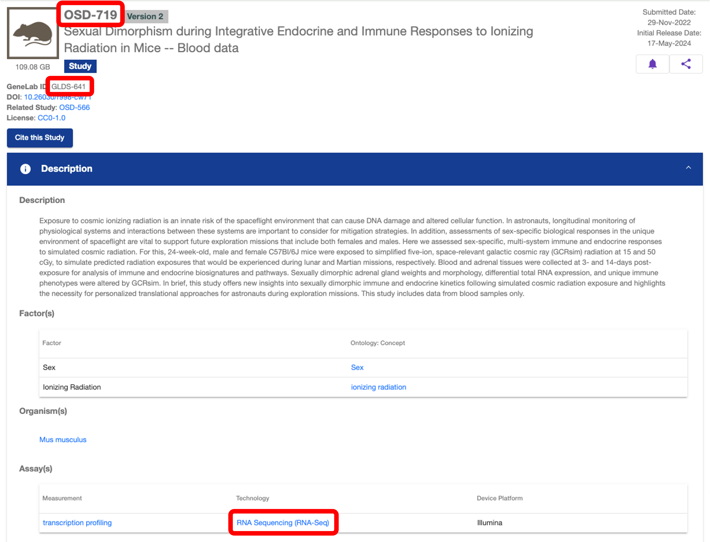
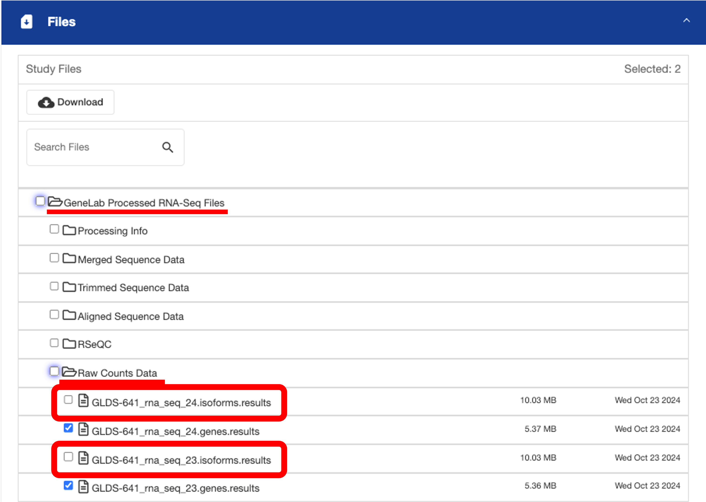
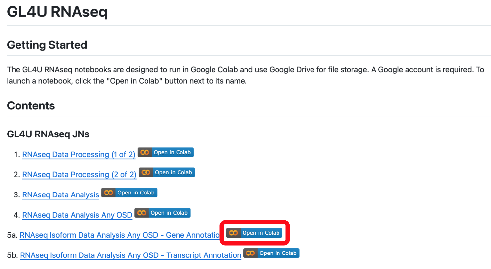
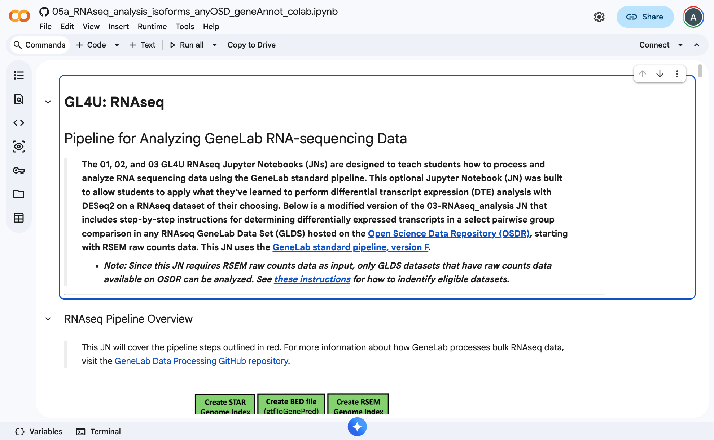
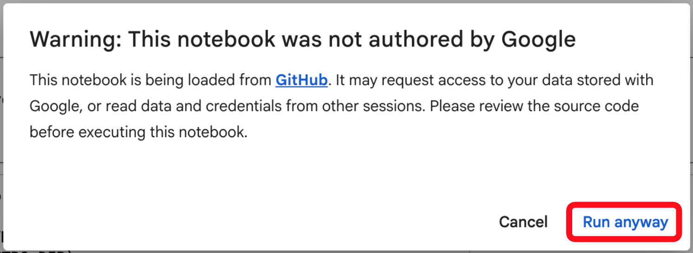

# RNA Sequence Isoform Data Analysis On Any OSD Dataset

During this (optional) hands-on activity, you will have the opportunity to analyze the isoform data from any RNA sequencing (RNAseq) dataset hosted on OSDR using a Jupyter Notebook (JN) within a Google Colab environment.  
> _Notes:_
> - _If you have not completed all activities from the previous [RNAseq Analysis JN](Access_Analysis_JN.md), please go back and complete those activities before this one._
> - _This JN uses gene IDs to add annotation columns to your differential isoform expression output table._
> - _We'll be using Google Colab, so if you haven't done so already, follow [these instructions](https://github.com/nasa/GeneLab-Training/blob/GL4U_Intro_2024_Colab/On-Demand/Colab_Instructions.md) to set up your Google account and verify access to Google Colab._

 

## Find An OSD Dataset To Analyze 

1. Before getting started, navigate to the [OSDR repository](https://osdr.nasa.gov/bio/repo/) and find a dataset you want to analyze.
   > _Note: If you are unfamiliar with the OSDR repository, review the [Access Data in the Open Science Data Repository](https://osdr-tutorials.readthedocs.io/en/latest/pages/guides/access_osdr_data.html) tutorial guide._

2. Click on the study link to navigate to the select OSD study page.
   > _Note: For study page assistance, review the [Navigate an OSDR Study Page](https://osdr-tutorials.readthedocs.io/en/latest/pages/guides/navigate_an_osdr_study_page.html) tutorial guide._

3. Once on the study page, make a note of the OSD identifier and the GLDS identifier, as indicated in the screenshot below (you will need these for the hands-on activity). Also check the "Assay(s)" section of the study page to make sure that "RNA Sequencing (RNA-Seq)" is shown as one of the available Technologies for that dataset, as indicated below.

  

 

4. The hands-on activity requires the `*isoforms.results` RSEM output files. Check to make sure your select dataset has these files available by looking in the Files section under the "GeneLab Processed RNA-Seq Files" -> "Raw Counts Data" folder, as shown in the screenshot below.
   > _Notes:_
   > - _If your select study does not have these files, go back to step 1 and search for a different dataset that does have the `*isoforms.results` RSEM output files available._
   > - _You do not need to download these files, you just need to make sure they exist for your select study._

  

 

 

## Access the RNAseq Isoform Analysis Of Any OSD/GLDS Dataset Jupyter Notebook

1. If you are not already logged in to your Google account, got to [https://accounts.google.com/](https://accounts.google.com/) and log in.

2. Navigate to the [GL4U_RNAseq_2024_Colab README](../README.md) page and click on the "Open in Colab" icon next to "5a. RNAseq Isoform Data Analysis Any OSD - Gene Annotation", as shown below:
   > _Notes:_
   > - _This JN uses gene IDs to add annotation columns to your differential isoform expression output table. Since gene IDs often have more complete annotations, we recommend to use this this JN when analyzing isoform data, and then look up the precise annotation for any specific isoforms (transcript IDs) of interest. 
   > - _It is recommended to open the Colab notebook in a new tab so these instructions remain available._

  

  

3. You should now see the 05a_RNAseq_analysis_isoforms_anyOSD_geneAnnot_colab.ipynb jupyter notebook (JN) opened in Google Colab, as shown below:

  

 

4. Follow the instructions in the 05a_RNAseq_analysis_isoforms_anyOSD_geneAnnot_colab.ipynb JN to complete all activities. Read through the JN carefully so you do not miss any activities.
   > Note: When you run your first code cell in the Colab notebook, you may see the following pop-up. If you do, click "Run anyway" to continue, as shown below:

  

 

## Save Your Completed JN

1. After you have completed all activities in the 05a_RNAseq_analysis_isoforms_anyOSD_geneAnnot_colab.ipynb JN and saved your completed JN to your Google Drive, open [Google Drive](https://drive.google.com/drive/my-drive) in a new tab, and click "My Drive" in the left side panel, then double click on the "Colab Notebooks" folder as shown below.

  

 

2. In the "Colab Notebooks" folder, click on the 3 dots to the right of the "Copy of 05a_RNAseq_analysis_isoforms_anyOSD_geneAnnot_colab.ipynb" file, then click "Download", as shown below, to save a copy to your computer.

  

 

3. You should now have a copy of your completed JN saved to your computer
 
   > _Note: Since this is not a required assignment in GL4U, you do not have to upload this JN to Canvas._  
