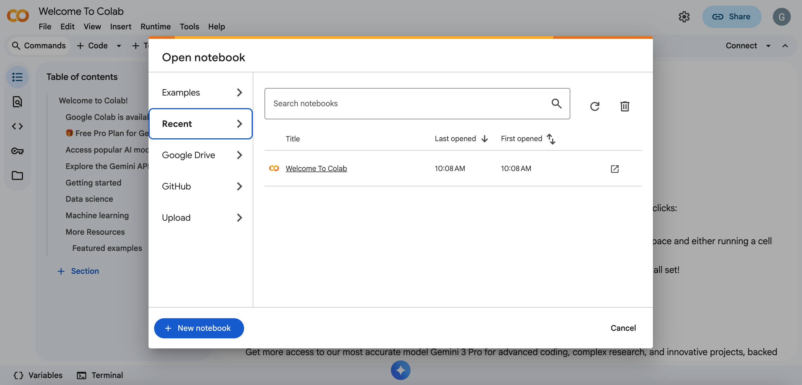
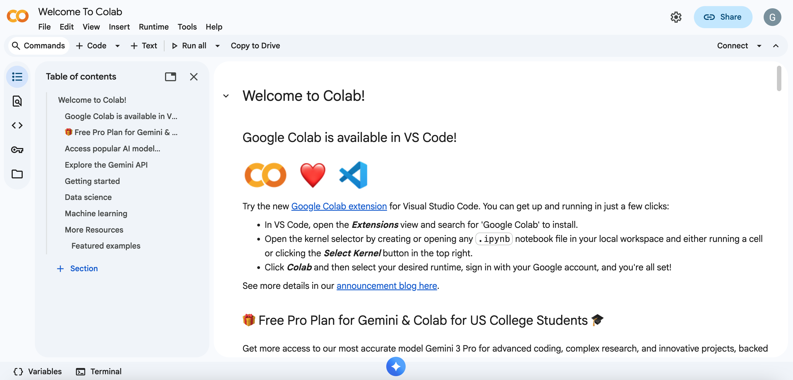
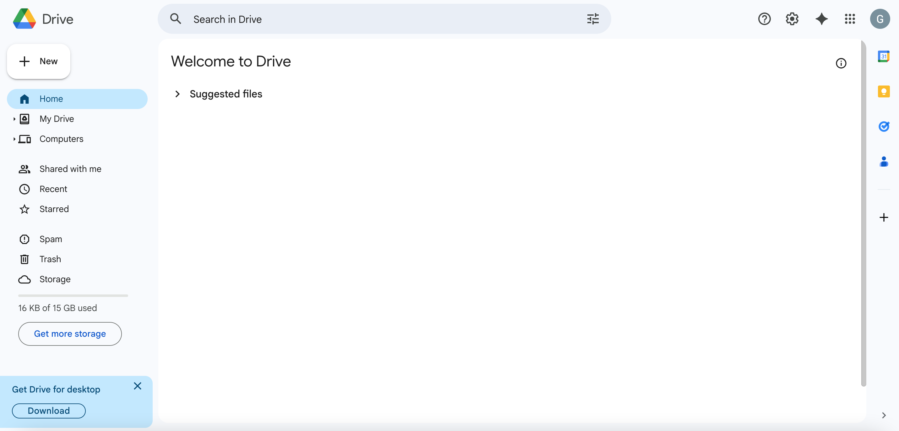

## Getting Started With Google Colab

The GL4U hands-on activities are run using [Google Colab](https://colab.research.google.com/), which offers free monthly compute resources 
using your [Google account](https://accounts.google.com/). If you're new to Google Colab follow the step-by-step instructions below to 
learn how to get started.

### Create a Google Account

1. If you don't already have an account, go to [https://accounts.google.com/](https://accounts.google.com/) and create one by following 
the instructions..
   
2. Log in to your Google account here: [https://accounts.google.com/](https://accounts.google.com/).
   > _Note: You will need to remain logged in to your Google account while completing the GL4U hands-on activities._

### Verify Access To Google Colab and Google Drive

1. While you are logged in to your Google account, open a new browser tab and go to 
[Google Colab](https://colab.research.google.com/). If you are successfully logged in, you should see the following 
pop-up.

 

2. Click "Cancel" in the bottom right corner of the pop-up, then take a screenshot of your Google Colab homepage, which should look as follows:

 

3. Next, open a new browser tab and go to [Google Drive](https://drive.google.com/drive/home). If you are successfully logged in, you 
will see your google drive homepage, which will look as follows. Take a screenshot of your Google Drive homepage. 
   > _Note: All of the files you generate during the GL4U courses will be saved in your google drive._

 

4. Return to Canvas and upload the screenshots of both your Google Colab homepage and your Google Drive homepage to "HANDS-ON_ACTIVITY_1" 
to show you successfully created a Google account and can access Google Colab and Google Drive.
