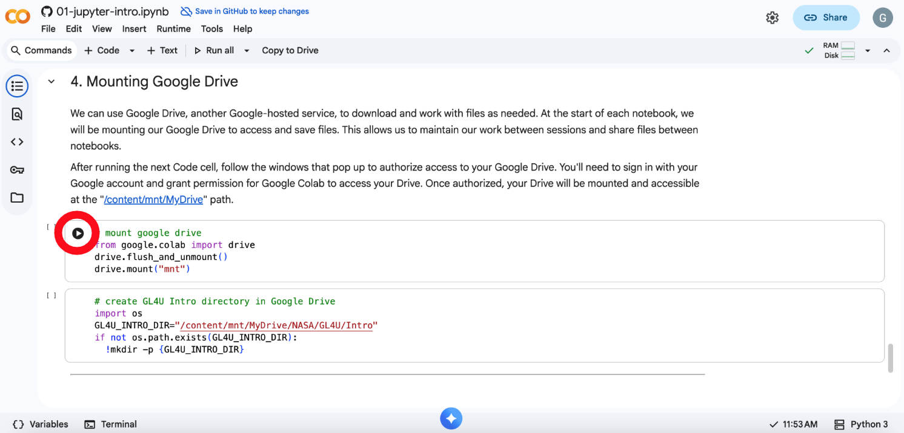
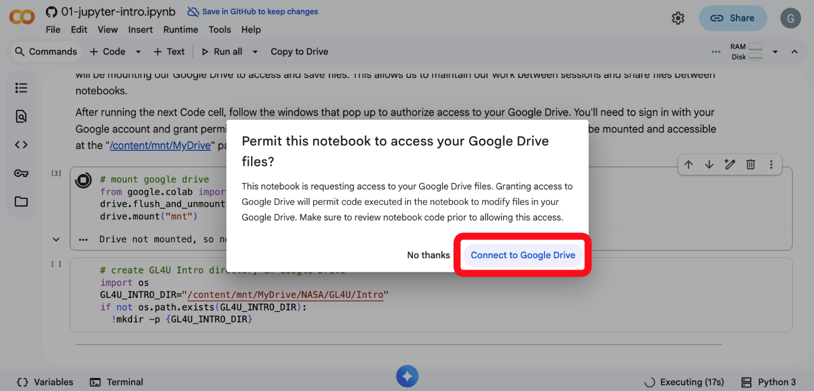
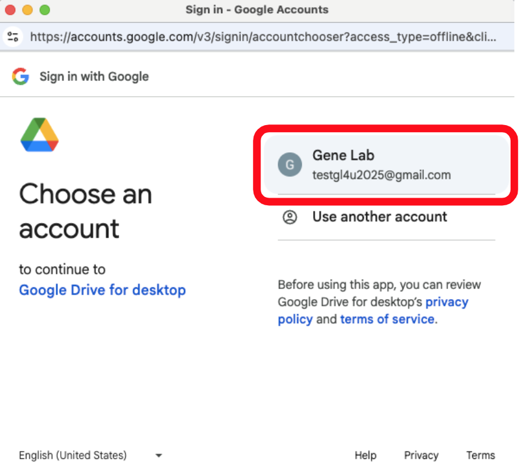
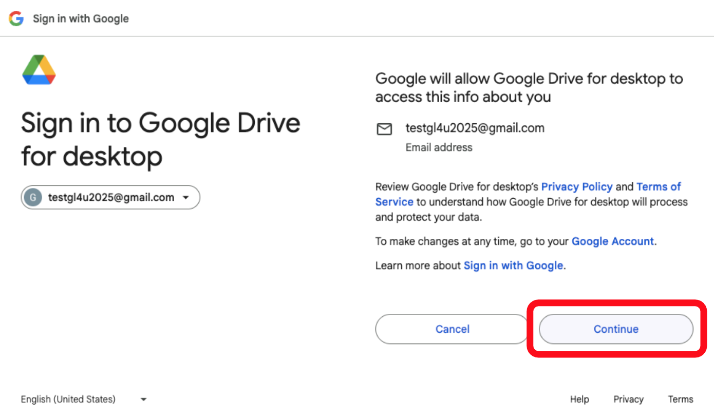
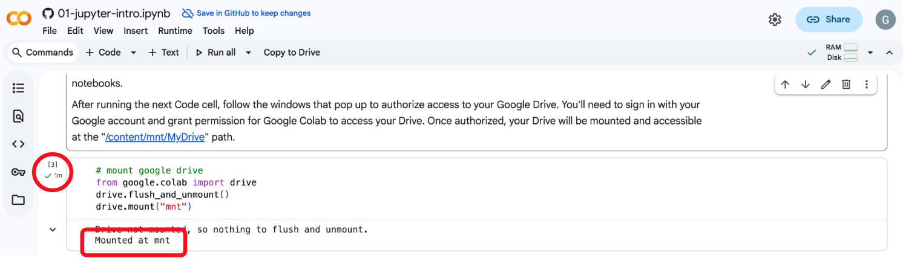

## Mount Google Drive To Google Colab

Follow the step-by-step instructions below to mount your google drive to the GL4U Google Colab jupyter notebooks (JNs).
> _Note: The example below shows screenshots from the 01-jupyter-intro JN, but the process is the same for all GL4U JNs._

1. Execute the code block to mount the google drive in the respective GL4U JN by clicking on the play icon.

  

 

2. Click the "Connect to Google Drive" button when prompted as shown below.

  

 

3. Double click on your google account when prompted as shown below.

   > _Note: Your google account name will be different than the one shown in the example below._

  

 

4. Click "Continue" to sign in to your google drive connected to your google account as shown below.

  

 

5. When prompted, check the box next to "Select all" to allow Google Drive to access your Google account, then click "Continue" as shown 
below.

   > Note: _You must click "Select all" for your Google drive to properly connect to Google Colab. You should only have to do this once._ 

  

 

6. Your drive should now be successfully mounted to Google Colab. You will see a green check mark next to the code block to mount the 
google drive in the respective GL4U JN, and the output will state "Mounted at mnt" as shown below.

  

 

7. You can now continue following the instructions in the respective GL4U JN.

