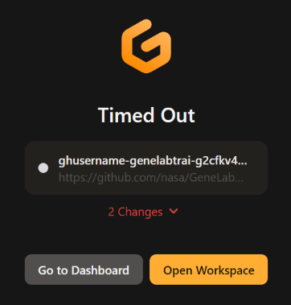

# GL4U Intro 

  
*Click the button above to launch an interactive Gitpod workspace.*  

  
⚠️ <strong>Important: Understand Gitpod Session Timeouts Before Launching Gitpod</strong>

By default, Gitpod workspaces have an inactivity timeout of **30 minutes**. If there is no user input during this time, your workspace will stop. Additionally, if you close the Gitpod workspace tab, the timeout reduces to **5 minutes**.

If your workspace stops due to inactivity, you can restart it from your [Gitpod Workspaces](https://gitpod.io/workspaces) page. Look for your workspace in the list and click on its name to restart it.

For more details on workspace lifecycle and managing timeouts, see the [Gitpod Workspace Lifecycle Documentation](https://www.gitpod.io/docs/configure/workspaces/workspace-lifecycle).

  

 

## Getting Started  

To run these notebooks interactively, click the "Open in Gitpod" button above. This will launch a Gitpod workspace with VSCode, Jupyter, and all necessary dependencies installed. No additional setup is required.

 

## Using Gitpod  

When you open the project in Gitpod:

1. **Wait for the environment to set up.** The VSCode editor will open within the Gitpod workspace.
2. **Navigate to the Notebooks:** In the VSCode interface, use the file explorer on the left to navigate to the Jupyter Notebooks (files ending with `.ipynb`).
3. **Open a Notebook:** Click on a notebook file to open it in the editor.
4. **Select the Appropriate Kernel:** Ensure that the correct kernel (Bash, Python, or R) is selected for each notebook. You can select the kernel by clicking on the kernel name at the top right corner of the notebook editor.
5. **Run Cells:** You can run the cells directly within VSCode by clicking on the Run button (▶️) to the left of the cell or pressing `Shift+Enter`.

> **Note:** Remember to save your work frequently. While Gitpod automatically saves changes, it's good practice to save to prevent data loss in case of a timeout.

 

## Contents  

### GL4U Intro JNs  
1. [Introduction to Jupyter](GL4U_Intro_JNs/01-jupyter-intro.ipynb)
2. [Unix Introduction](GL4U_Intro_JNs/02-unix-intro.ipynb)
3. [R Introduction](GL4U_Intro_JNs/03-R-intro.ipynb)
4. [Sequencing Data Quality Control](GL4U_Intro_JNs/04-sequencing-data-QC.ipynb)

### Intro  
* [Intro](intro)
  - Directory holding the input files we will use in the GL4U Intro JNs

### GL4U Intro Lectures
1. [Introduction to NASA, Science Mission Directorate, Space Biology, Open Science Data Repository, and GeneLab](GL4U_Intro_Lectures/NASA_SB_OSDR_GL_Intro_2024_compressed.pdf)
2. [Introduction to the command line, Unix and R commands, and Jupyter](GL4U_Intro_Lectures/CL_R_Jupyter_Intro_2024.pdf)
3. [Overview of short read sequencing](GL4U_Intro_Lectures/Short_Read_Sequencing_Overview_2024_compressed.pdf)

 

## Troubleshooting Gitpod Timeout 

Gitpod will time out after **30 minutes** of inactivity. When this happens, your workspace will stop, and a timeout message will be displayed.

To restart your session:

1. **Go to your [Gitpod Workspaces](https://gitpod.io/workspaces) page.**
2. **Find your workspace in the list and click on its name to restart it.**
3. **Wait for the workspace to reload.**

> _Note: After restarting your workspace, make sure to re-run all code cells in your notebooks to reinitialize variables._

For more information on managing your workspaces, refer to the [Gitpod Workspace Lifecycle Documentation](https://www.gitpod.io/docs/configure/workspaces/workspace-lifecycle).
