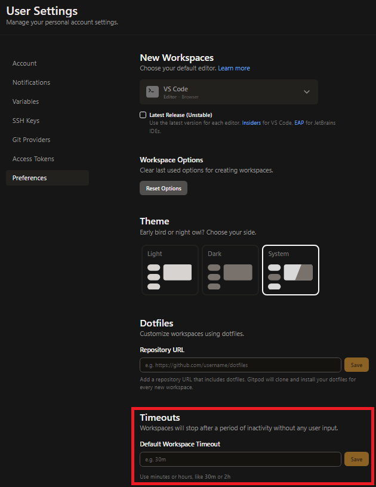
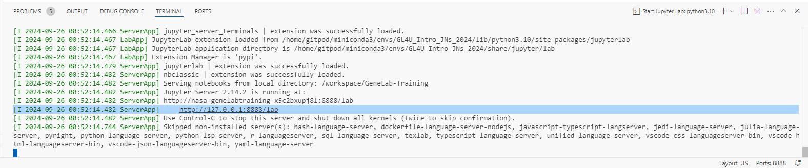

# GL4U Intro 

  
*Click the button above to launch an interactive Gitpod workspace.*  

  
⚠️ <strong>Important: Understand Gitpod Session Timeouts Before Launching Gitpod</strong>

By default, Gitpod workspaces have an inactivity timeout of **30 minutes**. If there is no user input during this time, your workspace will stop. Additionally, if you close the Gitpod editor tab (but leave JupyterLab open), the timeout reduces to **5 minutes**. 

To avoid unexpected disconnections:

- **Keep both the Gitpod editor and JupyterLab tabs open while working.**

You can adjust your timeout settings (default: 30 minutes) in your [Gitpod User Preferences](https://gitpod.io/user/preferences) as shown below:

  

## Getting Started  

> Note: Review the [section about Gitpod session timeouts](#understanding-gitpod-session-timeouts) and adjust your default timeout settings as needed.  

To run these notebooks interactively, click the "Open in Gitpod" button above. This will launch a Gitpod workspace with JupyterLab and all necessary dependencies installed.  

## Using Gitpod  

When you open the project in Gitpod:  

1. Wait for the environment to set up and JupyterLab to start in the background.
2. Look for a message in the terminal that contains the URL: http://127.0.0.1:8888/lab
   It will look similar to this:

   

3. Click on this URL to open JupyterLab in a new tab.
4. All notebooks and data files will be available in the JupyterLab interface.

## Contents  

### GL4U Intro JNs  
1. [Introduction to Jupyter](GL4U_Intro_JNs/01-jupyter-intro.ipynb)
2. [Unix Introduction](GL4U_Intro_JNs/02-unix-intro.ipynb)
3. [R Introduction](GL4U_Intro_JNs/03-R-intro.ipynb)
4. [Sequencing Data Quality Control](GL4U_Intro_JNs/04-sequencing-data-QC.ipynb)

### intro  
* [intro](intro)
  - Directory holding the input files we will use in the GL4U Intro JNs

## Troubleshooting Gitpod Time Out 

While completing the JNs in the Jupyter Lab environment, your GitPod session my timeout. If this happens, when you try to run a code cell in your JN you may get an error indicating that a folder or file is not found, as shown below:

If this happens, look at the tab containing your GitPod terminal (the one that contained the link to the Jupyter Lab). You will likely see the "Timed Out" message shown below. You can re-start your session by click on the "Open Workspace" button as shown below:
> _Note: Once you restart your workspace, make sure you re-run all the code blocks to ensure all variables are re-set and output files are generated._

